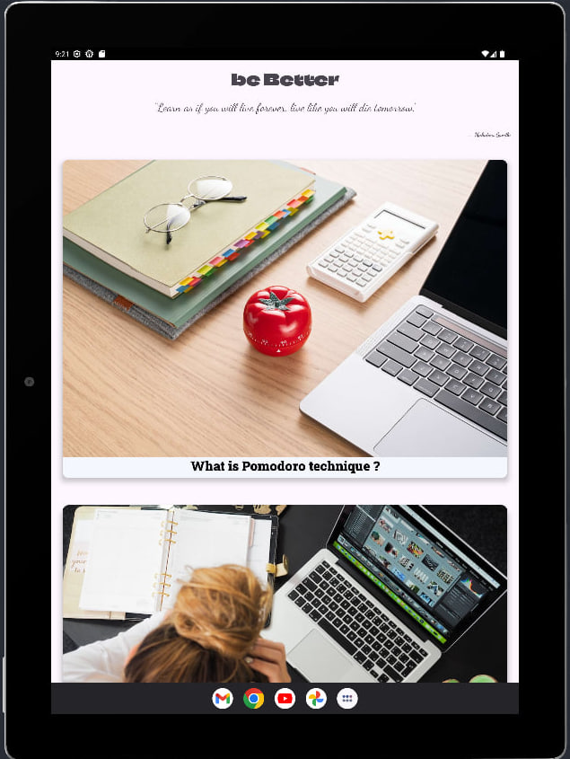

Server-client educational app connected to the Firebase service with configured authentication.
This app allows you not only to view different  educational videos, but also it is possible to sort
them by category, comment and rate them.
Start your self-development  with Vinci.

